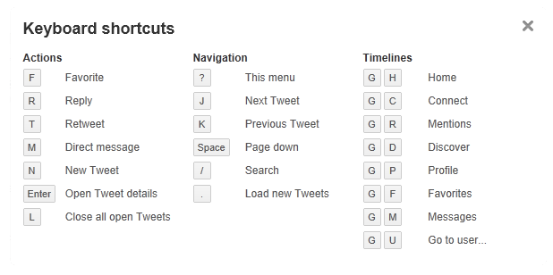
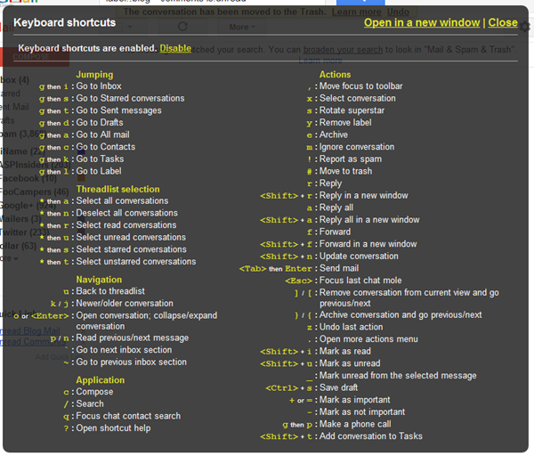
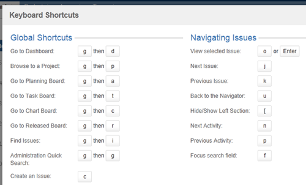

##### Keyboard Shortcuts for web application

Keyboard shortcuts are a good idea for software design, and would be a great idea for web design too, if there were better ways of making keyboard shortcuts available to users. 
Keyboard shortcuts are a powerful productivity booster widely used in desktop software. How can we apply them in web applications? Now web apps have become true working environments for many activities (including writing diplomas). 
Productivity and speed are a business necessity, not buzz words. Some keyboard shortcuts web apps inherit from the desktop software. But can we blindly copy them? Web developers can still use accesskey to create keyboard shortcuts,
but there are many considerations to take into account.

##### Why Keyboard Shortcuts ?

Shortcuts accelerate common actions and are mostly used by experts. So basically any web application that supports a stable scenario of repetitive actions and aimed at professionals can benefit from providing keyboard shortcuts to streamline the process.
It’s not the speed of just one operation (what’s faster to type Ctrl+C or to press Copy button in the toolbar?), but the whole sequence of actions and possibility to concentrate on the task at hand.

Taking hands off the keyboard to grab a mouse will slow you down because it breaks the flow of thought. Yet using shortcuts requires knowledge and experience, and with lack of standards, discoverability and learnability are the main problems you’re going to address when creating key maps for your web application.

##### How do users know if accesskey shortcuts are available?

One of the biggest problems with accesskey shortcuts is that users are not generally aware that they even exist, and there is no standard way of notifying them. Unlike the Windows environment, which underlines the letter of the keyboard shortcut in menus, there is no convention or "rule-of-thumb" for alerting users to the presence of an accesskey shortcut. 
Developers may choose to mimic the conventions of the Windows environment, or they may invent their own. All of these efforts, though well intentioned, fall short of the ideal. The ideal would be to have the user agents identify accesskey shortcuts for users, and indeed some screen readers do this. But this is not helpful for sighted keyboard users.
This should not be the responsibility of the developers at all. Nevertheless, since this ideal scenario does not exist, if developers choose to use accesskey shortcuts, they must somehow notify users that the accesskey shortcuts are available. Some methods of accomplishing this are:

1. Underlining the letter within a word that activates the accesskey, for example: Next Page.
* **Advantages:** Easy to implement. Some users will recognize this convention.
* **Disadvantages:** Not all users will recognize this convention; all users know which keystroke combination to use (is it Alt, Ctrl, Shift, etc.?).

2. Putting the accesskey in parentheses, for example: Next Page (Access key: N)
* **Advantages:** Easy to implement. All users will be able to read the text.
* **Disadvantages:** This changes the layout and look and feel of the Web content. Not all users will recognize this convention.; not all users know which keystroke combination to use.

3. Put the exact keystroke combination in parentheses, depending on which browser is being used, for example: Next Page (Alt + N)
* **Advantages:** This tells the user exactly what keystroke combination to use.
* **Disadvantages:** Requires browser detection scripts, either with JavaScript or server-side scripts; changes the layout and look and feel of the web content.

4. Create a list of accesskey shortcuts on a separate page and linking to them from all pages on the site that use the accesskey	shortcuts.
* **Advantages:** This puts all of the keyboard shortcuts in one place for easy reference
* **Disadvantages:** Users must go to a separate page in order to learn the keyboard shortcuts; requires the addition of an extra link on every page; users still may not know which keystroke combination to use (Alt, Shift, etc.) unless it is explained in the external file, in which case the file may be long and awkward.

5. Use more sophisticated CSS and/or browser detection approaches that expose the accesskey shortcuts when the elements receive focus or when the mouse hovers over them.
* **Advantages:** Does not interfere with visual layout; if both CSS and browser detection are used, then users can be notified of the exact keystroke combination necessary.
* **Disadvantages:** Requires working knowledge of advanced CSS and/or browser detection scripts.

##### Letters only shortcuts

There’s a very good option to spare yourself headache of selecting modifiers and avoid mixing them up with the native browser and OS shortcuts.
Letters. One or two letter shortcuts are simpler and easier to remember, they won’t interfere with OS or browser.
You can use one letter shortcuts for most common actions (c for comment), and two letter shortcuts for less common actions (gp for go projects page).

##### LETS HAVE A LOOK SOME WEB APPLICATIONS WITH AWESOME KEYBOARD SUPPORT

######Twitter

I use these Twitter keyboard shortcuts all the time. You don't need to learn them all. Just use . for refresh, / for search and G-R for replies and 
you're already ahead of the pack.

######Gmail

Gmail really gets credit for proving, in my opinion, that hotkeys on the web can be done elegantly and "just work." It may take a day or two but once you learn how to triage your email with just your keyboard you'll be surprised how fast you can get in and out and back to work.
I use J and K to navigate, X to select then # to delete or E to archive. Bam, bam, bam.

###### GitHub

Another example of a site you may be on for hours if it's part of your work. Github also supports ? for help and gives lots of shortcuts. Theirs are also J and K (which have meant up and down for folks familiar with vi and *nix editors) for moving up and down as well as X for toggling selection like Gmail, C for great, and / for search.
You see how a pattern is developing on its own?

###### Jira Bug Tracker

Jira from Atlassian is a popular bug tracker with this same keyboard model. Every web application needs to include a web popup like this when ? is pressed.

##### Using letter shortcuts while editing text

There’s also a problem - letter shortcuts don’t work when you’re writing. For this case you can either provide a simple way to step out of the editing mode (press ESC to switch modes, or Enter to finish editing, and e to edit again, etc.), use ‘smart syntax’ (Markdown or other formatting language), or append modifiers. 
For instance, you use / to set focus to the search field, but when you’re typing you’ll need a modifier for the same action, for example, Alt /.

Selecting keyboard shortcuts for a web application will mostly depend on what our customer is dealing with, but whatever you choose, make it a clear and consistent system, never set a shortcut just “because You like how it’s done in FooEditor”.
To keep the system consistent over time, have a keyboard cheat sheet before your eyes either in a digital or a print-out form. It will help you to select better shortcuts, to re-group shortcuts in the cheat sheet if necessary,
and generally to better understand what our customer is dealing with when we buzz about ‘productivity and convenience’.

**At the very least, I think it's fair to say that these are de facto standard shortcuts now on the web and you should think about what that means for your application.**

##### One-line takeaways

1. Don’t override native browser (or OS) shortcuts.
2. Support standard shortcuts that don’t contradict the previous rule, and use one or two letter shortcuts for other actions.
3. Always have a consistent system.
4. Good shortcuts mean happy and engaged users.

