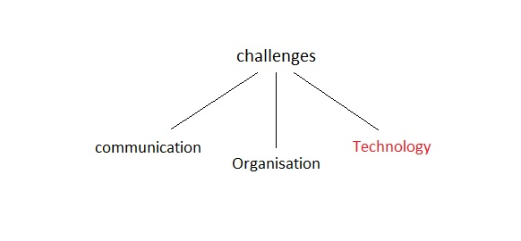

##### Enterprise UI Framework

When we talk about the large scale enterprise Front end development is essentially a mini-application that serves as a living library of the patterns, visual standards, 
and interaction behaviors as well as the framework and code samples for the actual front end of the user interface.

##### In the current State: 
* The Web is Evolving.
* One Design - Achive Multiple Implementations
* Hard to share things inteligently across teams

##### Which Leads To:
* Visual Inconsistencies
* Functional Differences
* Wasted Development Time/Resources
* Multiple Architectures & Approaches
* Increased Maintenance Cost

##### Sharing Has Many Advantages: 

* Consistent look and feel
* Allows for shared understanding of design and front end development best practices
* Allows re-use of assets in the application
* Allows the designers and developers to standardize a consistent set of patterns throughout the application
* Allows you to move away from repetitive specification documentation by just referencing your patterns
* One team making decisions and controlling the inportant stuff
  > Accessibility
  > Functionality
  > Responsive
  
##### Points to be taken care while prototyping 

* Navigation – Can someone go from Point A to Point B?
* Creative Design – Do people want to look at your application?
* Professionalism – How polished is the application’s presentation?
* Functionality – Do the application’s features work as intended?
* User input – Can people enter information without frustration?
* Search – Can people find what they are seeking with search?
* Guidance – Does the application give feedback and cues to help navigation?

##### How to kickstart Implementaion 

1. Design a very basic layout with a simple taxonomy for grouping your patterns on the left hand side of the page and a list of your actual patterns on the right in grid or image display.

2. Be clear on the naming convention for your patterns right away. This is what you reference in your specifications in all of your wireframe or prototype work so you don’t want to change them in the future.

3. Leverage your existing styles/layouts or Twitter Bootstrap/ZURB Foundation to jumpstart the code base.

4. Create very basic roles for administration of the application and viewing or editing. Like draft and published. Non-admins only view the published patterns.

5. Have a form for creating patterns that includes, at minimum, the name, the category, and image(s), as well as information on when to use, how to use, CSS (or SASS, LESS etc), and HTML examples displayed with HighlightJS or similar. We also provide a link to working example code. All of this information turns into the individual pattern page. Your users can then view the full list of patterns or drill down for details and code examples.

6. Pushed the SASS and any visual assets directly to the development team’s source code, so they didn’t need to go find it. We continue to improve communication on best practices being followed within the SASS as comments on the toolkit.

7. Add the ability to show dates of recent updates, recent changes, or archived patterns that have been replaced with new ones.

8. Add the option to link related patterns since some patterns such as form controls are often contained within parent patterns.

9. Style the UI toolkit the same way that you would style the real application, to re-enforce working examples of your standards.

10. If you have more than 20 patterns, make sure they are searchable.

11. Consider making the toolkit interactive and add video recordings of how to use the patterns for remotely dispersed teams.

##### Good To Have Features:

* Authentication
* Brokers a Trusted Applications connection if available and required
* Brokers an OAuth connection if available and required
* View Helpers
* Automatic reloading of a gadget based on a time interval
* Automatic reloading of a gadget on browser window resize
* Automatic gadget resizing on browser window resize
* Parallel Ajax resource loading for the view
* Configuration
* Permission-based gadget configuration
* Configuration screen display on initial gadget load
* Complex configuration form building
* Validation of configuration
* Inline error display
* Saving of parameters
* Parallel Ajax resource loading for configuration form
* jQuery-style remoting
* A wrapper over gadgets.io.makeRequest supplying a cleaner and more common interface for Ajax calls
* Cookie storage
* Cookie storage and retrieval on a gadget by gadget basis
* Performance
* Conversion of proxied remote calls into direct calls if possible
* Common styling
* Loading of screens, standard icons, common CSS

